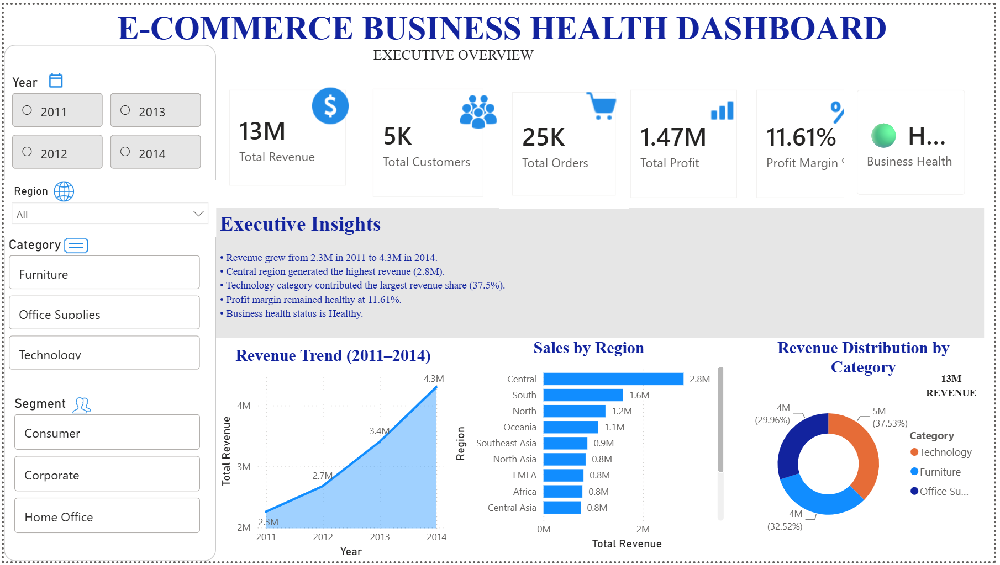
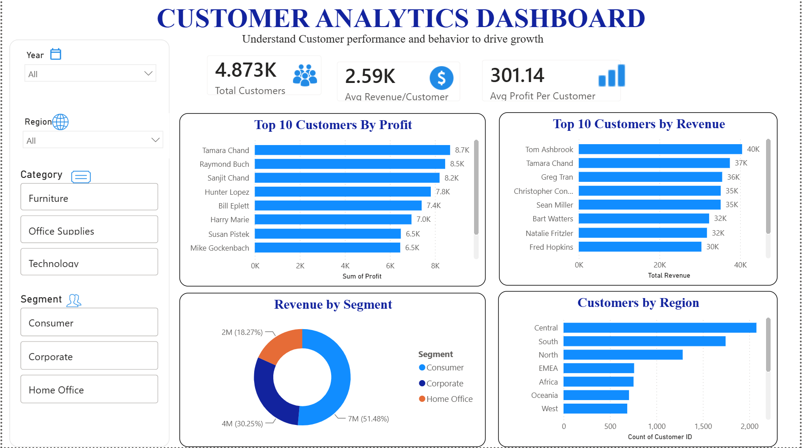
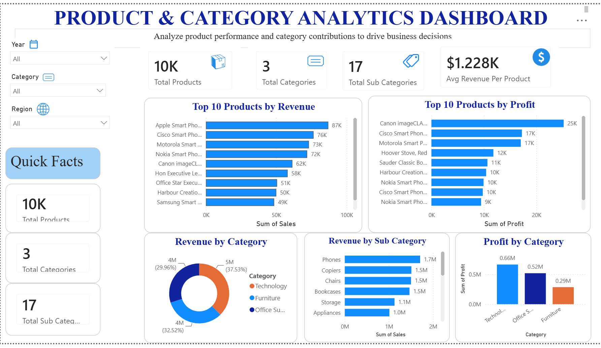

# 📊 Global Superstore Business Intelligence Dashboard

An interactive Power BI dashboard built using the Global Superstore dataset to analyze business performance, customer behavior, and product analytics.

---

## 🚀 Project Overview

This dashboard provides a complete business overview through three interactive pages:

### 1️⃣ Executive Overview
- Total Revenue
- Total Customers
- Total Orders
- Total Profit
- Profit Margin %
- Business Health Indicator
- Revenue Trend Analysis
- Sales by Region
- Revenue Distribution by Category

### 2️⃣ Customer Analytics
- Top 10 Customers by Revenue
- Top 10 Customers by Profit
- Revenue by Segment
- Customers by Region
- Customer Insights

### 3️⃣ Product & Category Analytics
- Top 10 Products by Revenue
- Top 10 Products by Profit
- Revenue by Category
- Revenue by Sub-Category
- Profit by Category
- Product Performance Insights

---

## 🛠️ Tools & Technologies

- Power BI
- DAX (Data Analysis Expressions)
- Data Modeling
- Data Visualization
- Business Intelligence

---

## 📈 Key Features

✅ Interactive Slicers

- Year
- Region
- Category
- Segment

✅ KPI Cards

- Total Revenue
- Total Customers
- Total Orders
- Total Profit
- Profit Margin %
- Business Health Score

✅ Dynamic Filtering

All charts and KPIs update instantly based on user selections.

---

## 📷 Dashboard Screenshots

### Executive Overview

 (page 1)

### Customer Analytics

 (page 2)

### Product & Category Analytics

 (page 3)

---

## 🔍 Business Insights

- Revenue increased steadily from 2011 to 2014.
- Technology category generated the highest revenue.
- Central region contributed the largest sales volume.
- Consumer segment accounted for the highest share of revenue.
- Profit margins remained healthy across the business.

---

## 📂 Project Structure

```text
global-superstore-powerbi-dashboard
│
├── Dashboard.pbix
├── README.md
├── screenshots
│   ├── executive-overview(page 1).png
│   ├── customer-analytics (page 2).png
│   └── product-analytics (page 3).png
│
└── dataset
    └── superstore.csv
```

---

## 🎯 Learning Outcomes

Through this project, I gained hands-on experience in:

- Building interactive Power BI dashboards
- Creating DAX measures and KPIs
- Data modeling and relationships
- Business performance analysis
- Dashboard design and storytelling

---

## 👩‍💻 Author

**Alisha Gupta**

B.Tech CSE Student | Data Analytics Enthusiast | Power BI Developer

GitHub: https://github.com/01alisha
